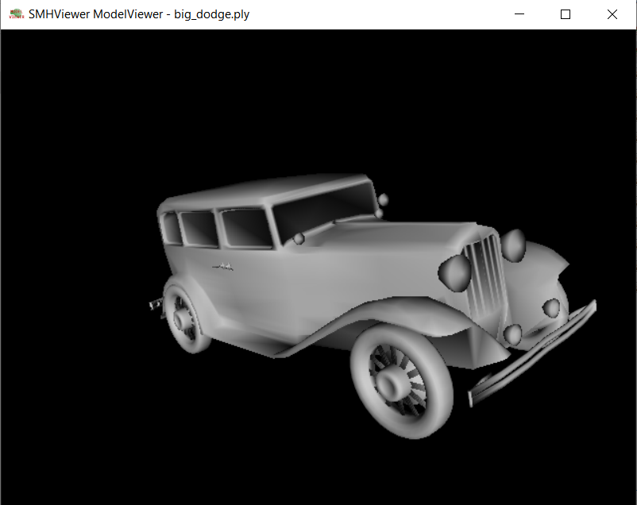
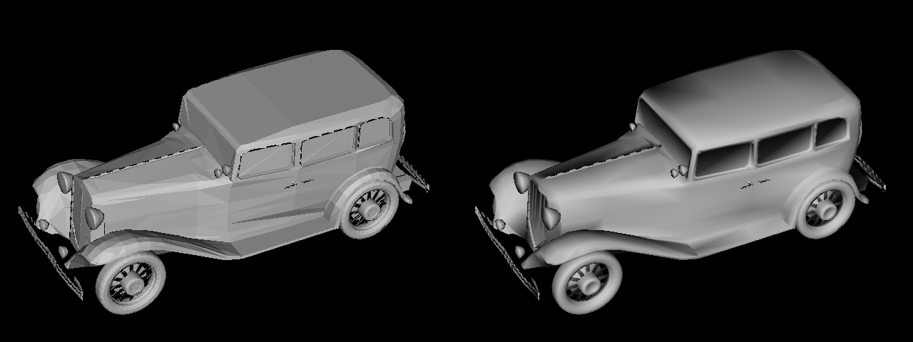
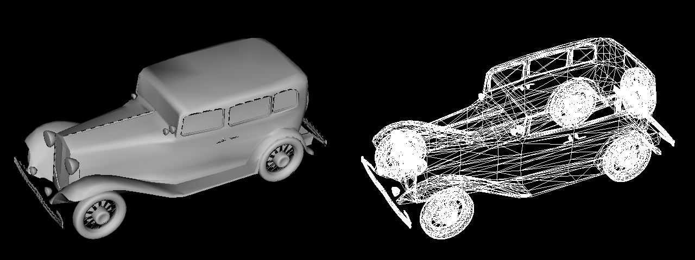
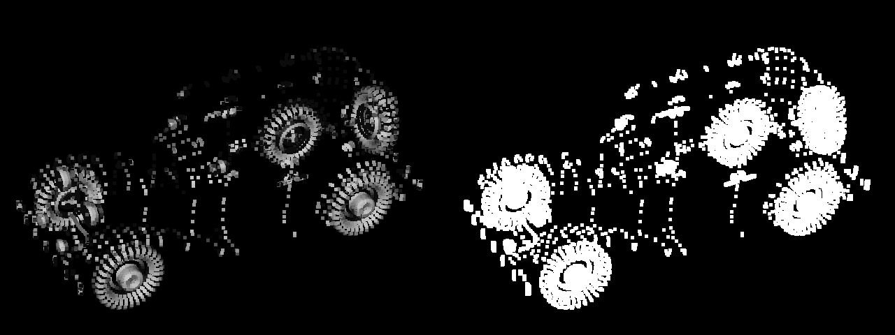
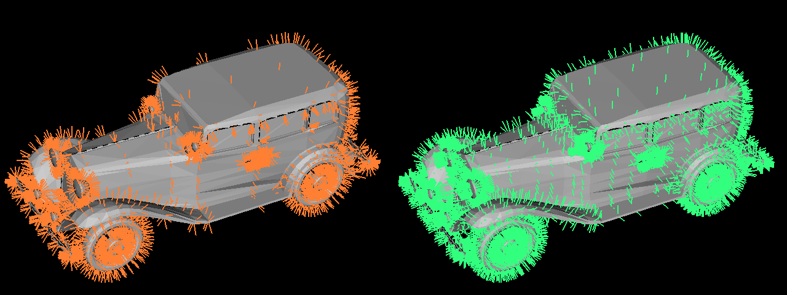
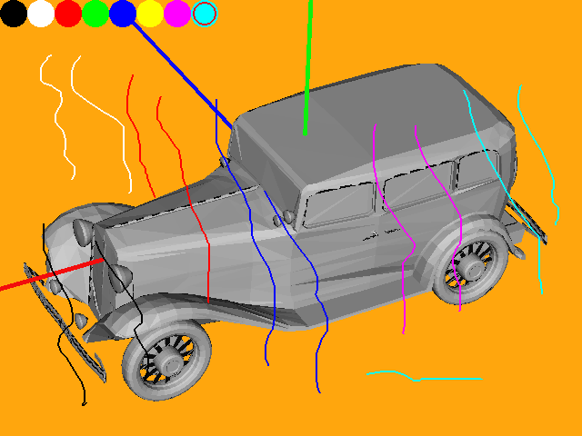
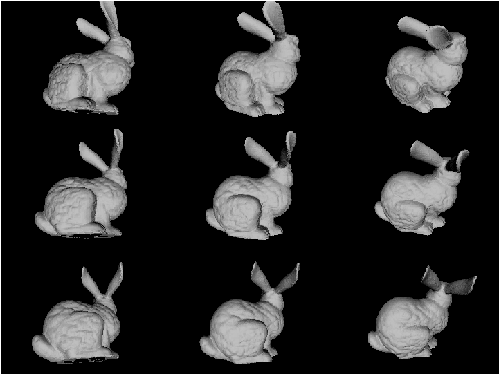

# Summary

We present a useful software written in C++ that can be used for a variety of purposes ranging from visualising 3D models to automated rendering of sequences for dataset generation. It comes with a wide range of features that are unique from existing comparable software packages. We discuss such features and their applicability for various research and general uses. 

# Statement of need

`SMHViewer` is a 3D point cloud and mesh model viewer. It is written in C++ and uses OpenGL to display and render 3D models of various formats. It supports namely, multiple variants of OFF format (the standard OFF format, OFF formats with additional vertex colours,  vertex normals, etc.), partially PLY [@TurkPLY] format, ASC format, CloudCompare [@CloudCompare] BIN version 1 format, COLMAP [@LCOLMAP] BIN format, NVM [@WuVisualSFM] format, Bundle [@SnavelyBundler] OUT format, XYZ format files. The user interface is shown in \autoref{fig:uisample}. The sample model used is available at [@data].

{ width=80% }

  The software `SMHViewer` was designed to support two ways of viewer multiple files, namely:
`ModelViewer` (through executable `modelviewer.exe`) and `MultiViewer` (through executable `multiviewer.exe`). While `ModelViewer` renders one model at a time, `MultiViewer` renders all the models at the same time and same window. Both of them supports programmable rendering through configuration files that can be passed as command-line argument. The software was written to support viewing and rendering of all the popular formats that are used for 3D reconstructions pipelines. The software supports full-screen viewing also. In the following, we discuss the salient features present in `SMHViewer`. While visual inspection is a major step in research in computer vision, the software is also capable of generating synthetic data automatically through configuration files.

# Salient features

## Command line 

The default command-line syntax is given as follows.  
`modelviewer/multiviewer [-f] [-c cfg_fname] file1 [file2 [file3 [...]]] `

In the above, `-f` cans be used to directly open full-screen mode. The `-c` followed with a configuration filename can be used to programmatically control different aspects of the rendering and display. Thereafter, the command line is followed with at least one model filename.

## Controls

The various controls can be divided into two groups, namely `mouse controls` and `keyboard controls`.

### Mouse Controls

Mouse controls comprise rotation, panning, changing field-of-view, toggling between object-centric and eye-centric views.  
   
### Keyboard Controls

Keyboard controls comprise rotation, panning, changing lighting and other rendering configurations. 

## Rendering-modes

There are three surface rendering modes namely, flat-mode, smooth-mode and finally smooth mode with edges. While the flat mode is rendered using flat triangles without using any additional supplied or computed vertex normals, the smooth-mode uses the vertex-normals either using the supplied ones or if possible by computing. The third mode is one that it checks whether a vertex belongs to an edge or not, and then it uses smooth-shading if it does not. 

A number of rendering modes are shown in \autoref{fig:rmode00}, \autoref{fig:rmode01}, \autoref{fig:rmode02}, and \autoref{fig:rmode03}.

{ width=84% }

{ width=84% }

{ width=84% }

{ width=84% }

Moreover, screenshots can be taken with various configurations.

## Pen-mode

A distinct feature of the software is the pen-mode. In the pen-mode one can use a normal graphic pen or a pointer to write or mark on an overlay in front of the 3D rendered model. This mode has the basic utilities like pen-colour selection, eraser, screen clearing, etc.
 A view of the pen-mode is shown in Figure \autoref{fig:penmode}.
 
{ width=42% }

## Configurations

One feature of the software is the configurations that can be supplied to the executables in files through the command line. The configurations are the different rendering configurations that be also set programmatically. This is useful, for example, to automate a rendering in batches. 

## Data Generation

One major feature of the software SMHViewer is that it can be used to generate data from 3D models. This is very useful for research purposes in the field of 3D reconstruction and other related areas. We describe its uses in the following.
In 3D reconstruction and multiview photometry, it is often required to use synthetic datasets which are used to test and analyse the performances of reconstruction methods. In such cases, multiple views of known geometries are generated as colour images. The software can generate such data as required easily. Figure \autoref{fig:bunny} shows such generated sample images. The sample model used is available at [@data2].

{ width=42% }.

This is generated using the following commands from the configurations files.

      height 240  
      width 320
      pos 0 0 0  
      rot -0.436 -0.436 0  
      save 100.png
      rot -0.436 0 0  
      save 101.png
      rot -0.436 0.436 0  
      save 102.png
      rot 0 -0.436 0  
      save 110.png
      rot 0 0 0  
      save 111.png
      rot 0 0.436 0  
      save 112.png
      rot 0.436 -0.436 0  
      save 120.png
      rot 0.436 0 0  
      save 121.png
      rot 0.436 0.436 0  
      save 122.png
      exit 
  

# References
